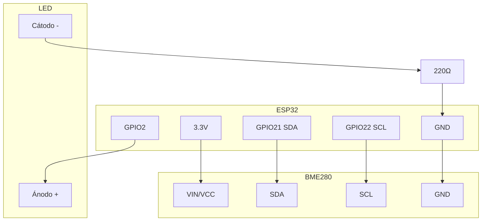
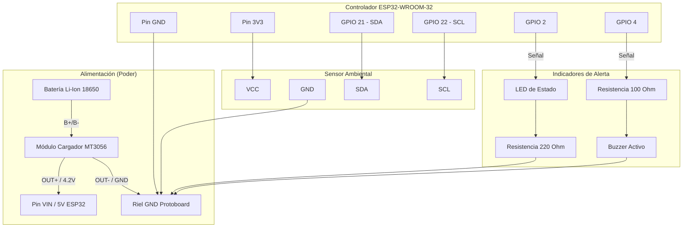

# Esquema de Conexiones Eléctricas - Anura AI Monitor

Este documento contiene la distribución de pines (pinout) y las conexiones eléctricas del prototipo Anura AI Monitor.

---

## 1. Tabla de Interconexión de Pines Minimo funcional

Guía de conexiones para producto mínimamente viable (Guía de conexiones)

| BME280 | ESP32   |
| ------ | ------- |
| VCC    | 3.3V    |
| GND    | GND     |
| SDA    | GPIO 21 |
| SCL    | GPIO 22 |

| LED                     | ESP32                    |
| ----------------------- | ------------------------ |
| Ánodo (+, pata larga)  | GPIO 2                   |
| Cátodo (-, pata corta) | Resistencia 220Ω → GND |

### 2. Diagrama Esquemático (Mermaid)

---

## 1. Tabla de Interconexión de Pines Completo

A continuación se detallan las conexiones cable a cable para armar el circuito.

| Componente Origen                    | Pin Origen    | Componente Destino                   | Pin Destino   | Descripción                                |
| :----------------------------------- | :------------ | :----------------------------------- | :------------ | :------------------------------------------ |
| **ESP32 DevKit**               | 3V3           | **BME280**                     | VCC           | Alimentación lógica del sensor (3.3V)     |
| **ESP32 DevKit**               | GND           | **Riel GND Protoboard**        | GND           | Tierra lógica de referencia común         |
| **ESP32 DevKit**               | GPIO 21 (SDA) | **BME280**                     | SDA           | Línea de datos del bus I2C                 |
| **ESP32 DevKit**               | GPIO 22 (SCL) | **BME280**                     | SCL           | Línea de reloj del bus I2C                 |
| **ESP32 DevKit**               | GPIO 2        | **LED Verde (Ánodo)**         | Pin Largo (+) | Señal del LED de estado                    |
| **LED Verde (Cátodo)**        | Pin Corto (-) | **Resistencia 220 $\Omega$** | Terminal A    | Resistencia limitadora de corriente         |
| **Resistencia 220 $\Omega$** | Terminal B    | **Riel GND Protoboard**        | GND           | Cierre del circuito del LED                 |
| **ESP32 DevKit**               | GPIO 4        | **Resistencia 100 $\Omega$** | Terminal A    | Resistencia limitadora para Buzzer          |
| **Resistencia 100 $\Omega$** | Terminal B    | **Buzzer Activo (+)**          | Pin (+)       | Señal del buzzer para alertas              |
| **Buzzer Activo (-)**          | Pin (-)       | **Riel GND Protoboard**        | GND           | Cierre del circuito del Buzzer              |
| **Batería Li-Ion 18650**      | Positivo (+)  | **Cargador MT3056/TP4056**     | B+            | Entrada positiva de batería al cargador    |
| **Batería Li-Ion 18650**      | Negativo (-)  | **Cargador MT3056/TP4056**     | B-            | Entrada negativa de batería al cargador    |
| **Cargador MT3056/TP4056**     | OUT+          | **ESP32 DevKit**               | VIN / 5V      | Alimentación del sistema (4.2V - 3.7V bat) |
| **Cargador MT3056/TP4056**     | OUT-          | **Riel GND Protoboard**        | GND           | Tierra común del cargador                  |

---

### 2. Diagrama Esquemático (Mermaid)

El siguiente diagrama representa visualmente la topología del circuito:

---

## 3. Notas de Diseño Eléctrico

1. **Resistencias de Pull-Up I2C:** Módulos comerciales BME280 usualmente integran resistencias pull-up de 10k o 4.7k $\Omega$ a VCC en las líneas SDA y SCL. Si el sensor está en un cable largo de más de 30 cm, se aconseja añadir resistencias de pull-up externas de 4.7k $\Omega$ entre SDA $\rightarrow$ 3V3 y SCL $\rightarrow$ 3V3 para estabilizar las lecturas aunque para el proyecto se utilizaron cables jumpers de 10 centímetros, lo cual permitió la transmisión de datos sin ningún tipo de problema.
2. **Consumo del Buzzer:** Un pin GPIO del ESP32 entrega hasta 40mA como máximo absoluto, pero se recomienda no sobrepasar los 20mA. El zumbador activo consume alrededor de 15mA a 3.3V, por lo que la resistencia de 100 $\Omega$ protege el pin limitando la corriente sobradamente

En caso de tener problemas de voltaje o falta de fuente de alimentación, como mínimo requerimiento, si desea puede eliminar la necesidad de un buzzer como señal de funcionamiento.

---

## Enlaces de Navegación
| Documento | Propósito |
|-----------|-----------|
| [Manual_Montaje.md](Manual_Montaje.md) | Manual paso a paso de ensamble |
| [Guia_Alimentacion_Energia.md](Guia_Alimentacion_Energia.md) | Gestión de energía y batería |
| [Lista_Componentes.md](Lista_Componentes.md) | Lista de materiales y BOM |
| [datasheets.md](datasheets.md) | Datasheets técnicos |

[⬅️ Volver al Menú Principal](../README.md)