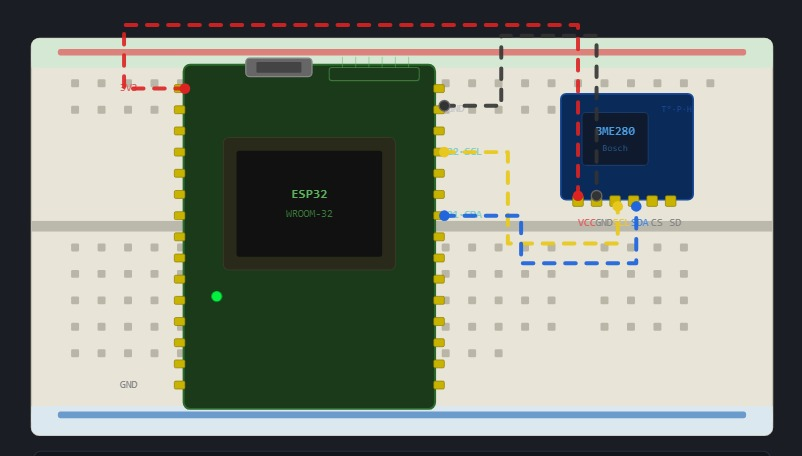

# Manual de Montaje Físico - Anura AI Monitor

Esta guía detalla paso a paso cómo realizar el ensamble físico de los componentes del nodo sensor **Anura AI Monitor** en una protoboard o placa de pruebas, utilizando un módulo ESP32, un sensor de clima BME280, un LED indicador, un zumbador (buzzer), resistencias limitadoras y un sistema de alimentación por batería gestionado por el cargador MT3056/TP4056.

---

## 1. Requisitos Previos y Herramientas

Antes de comenzar, asegúrate de tener los siguientes elementos a la mano:

- **Herramientas**:

  - Pelacables y alicates de punta fina.
  - Pinzas para manipular jumpers de conexión.
  - Multímetro digital (para verificar voltajes y continuidad).
- **Consumibles**:

  - Protoboard de 830 puntos.
  - Cables jumper macho-macho y macho-hembra.
  - Soldadura y cautín (si tu BME280 o ESP32 vienen sin pines soldados).

  Los elementos como los pelacables y el alicate de punta fina pueden ser reemplazados por un simple cúter para realizar el proceso, aunque es preferible utilizar los primeros para mayor facilidad. Las pinzas son útiles debido a la cantidad de cables que debemos manejar, y el multímetro digital sirve para revisar la continuidad; aunque, según los diagramas, no es estrictamente necesario, ya que se trata solo de medidas de seguridad.

  Para el prototipo, son necesarios los siguientes componentes:

  1. Protoboard de 830 puntos.
  2. Jumpers (macho-macho y macho-hembra):
     (a) Los macho-macho se utilizan principalmente en la mayoría de los casos.
     (b) Los macho-hembra son muy útiles si ocurren inconvenientes con el puerto micro USB de la ESP32.
  3. Soldador y cautín:
     (a) Son irreemplazables únicamente si el módulo BME280 y la ESP32 vienen sin los pines soldados.
     (b) Si ya vienen soldados, no son necesarios.

---

## 2. Paso a Paso del Ensamble

> [!WARNING]
> Nunca conectes la batería ni el puerto USB del ESP32 mientras estás realizando conexiones físicas en la protoboard. Esto previene cortocircuitos accidentales que podrían quemar las entradas analógicas o digitales del ESP32.

Es de suma importancia evitar este tipo de acciones, por lo cual sería útil, antes de realizar una conexión, realizar la simulación utilizando herramientas tales como:

1. Tinkercad
2. Wokwi
   (a) Está especializado en el ESP32.
   (b) Tiene un módulo BMP que puede simular el BME280.
   (c) Aunque no posee la capacidad de detectar presión, sirve como módulo para realizar las simulaciones.

### Paso 2.1: Posicionamiento del ESP32

Utilizando, si es posible, una protoboard de 830 puntos, conectar la ESP32 empezando desde la fila 1, ocupando los pines de la columna B hasta la J.

Por favor, dejad despejada la columna A, ya que es donde se encontrarán los datos de nuestras conexiones. En caso de que necesitemos las del otro lado, se pueden utilizar fácilmente cables por debajo para realizar la conexión, aprovechando las propiedades de la protoboard.
Conexión del ESP32:

1. Conexión al computador:
   Se puede realizar conectándolo directamente al puerto (ya sea microSD o microUSB).
2. Conexión a una batería:
   Se pueden utilizar las entradas de 5V y las GND. En este caso, se recomienda utilizar reguladores de corriente como el modelo mt3056.

### Paso 2.2: Conexión del Sensor BME280 (Bus I2C)

El sensor BME280 mide temperatura, humedad relativa y presión barométrica mediante comunicación I2C.

1. Inserta el sensor BME280 en un extremo libre de la protoboard.
2. Realiza las siguientes conexiones hacia el ESP32:
   - **VCC (BME280)** $\rightarrow$ Conéctalo al pin **3V3** del ESP32.
   - **GND (BME280)** $\rightarrow$ Conéctalo al riel de tierra (**GND**) de la protoboard.
   - **SCL (BME280)** $\rightarrow$ Conéctalo al pin **GPIO 22** del ESP32.
   - **SDA (BME280)** $\rightarrow$ Conéctalo al pin **GPIO 21** del ESP32.

### Paso 2.3: Conexión del LED de Estado

El LED sirve para retroalimentación visual (ej. parpadeo al transmitir datos, luz continua si hay error).

1. Inserta el **LED de 5mm** (por ejemplo, color verde o azul) en la protoboard.
2. Identifica la pata larga (Ánodo, +) y la pata corta (Cátodo, -).
3. Conecta una **resistencia de 220 $\Omega$** en serie con el cátodo (pata corta) hacia el riel de **GND**.
4. Conecta un cable jumper desde el ánodo (pata larga) al pin **GPIO 2** del ESP32.

Nota importante: se recuerda que, si es posible, se debe utilizar el mismo pin GND que se utilizó para realizar la conexión del ESP32, ya que es útil tener la conexión serial de los puertos GND.

Después de estos pasos, el resto son simplemente mejoras. Para el producto mínimo viable solo es necesario conectar el módulo BME280 y el LED de testeo para verificar la correcta conexión.

### Paso 2.4: Conexión del Buzzer (Zumbador)

El zumbador genera alertas auditivas (ej. cuando los parámetros ambientales son críticos para el hábitat).

1. Inserta el **Buzzer Activo de 5V/3.3V** en la protoboard.
2. Conecta la patilla negativa (-) directamente al riel de **GND** de la protoboard.
3. Conecta la patilla positiva (+) al pin **GPIO 4** del ESP32 a través de una **resistencia de 100 $\Omega$** (esto limita la corriente consumida directamente de los pines del microcontrolador, protegiéndolo).

### Paso 2.5: Circuito de Alimentación con Batería MT3056

Hasta el momento es posible limitar la conexión y la energización de todo utilizando simplemente la energía suministrada por el ESP32. Sin embargo, si desea utilizar una batería, se recomienda seguir estas indicaciones:

1. Utilizar una batería de 3,7 V.
2. Evitar cualquier tipo de batería con demasiados miliamperios (mAh), ya que es posible que la capacidad sea falsa.
3. Es recomendable utilizar una batería 18650 que cuente con protección; esta se puede determinar por una línea blanca que atraviesa la batería.
4. Contar con un cargador de batería universal para poder cargarla fácilmente.
5. Si es posible, utilizar un módulo MT3056 para evitar picos de batería.
6. Incorporar un capacitor para evitar fluctuaciones en los picos de energía, lo cual podría generar un reinicio en el Wi-Fi.

---

## 3. Checklist de Inspección Visual

Antes de alimentar el circuito, realiza este chequeo rápido:

* [ ] **Cero Puentes de Alimentación:** Asegúrate de que el pin de 3.3V y el de 5V (VIN) nunca hagan contacto directo.
* [ ] **Polaridad del LED y Buzzer:** Verifica que las patas negativas estén conectadas a GND y que las resistencias estén colocadas de forma correcta.
* [ ] **Alineación del ESP32:** Confirma que el microcontrolador no esté desplazado de tal forma que los pines de un lado hagan corto con el otro.
* [ ] **Soldaduras:** Revisa que los pines del BME280 no tengan puentes de soldadura entre sí.

---

## Enlaces de Navegación
| Documento | Propósito |
|-----------|-----------|
| [Esquematico_Conexiones.md](Esquematico_Conexiones.md) | Diagramas de conexiones eléctricas |
| [Guia_Alimentacion_Energia.md](Guia_Alimentacion_Energia.md) | Gestión de energía y batería |
| [Lista_Componentes.md](Lista_Componentes.md) | Lista de materiales y BOM |
| [datasheets.md](datasheets.md) | Datasheets técnicos |

[⬅️ Volver al Menú Principal](../README.md)