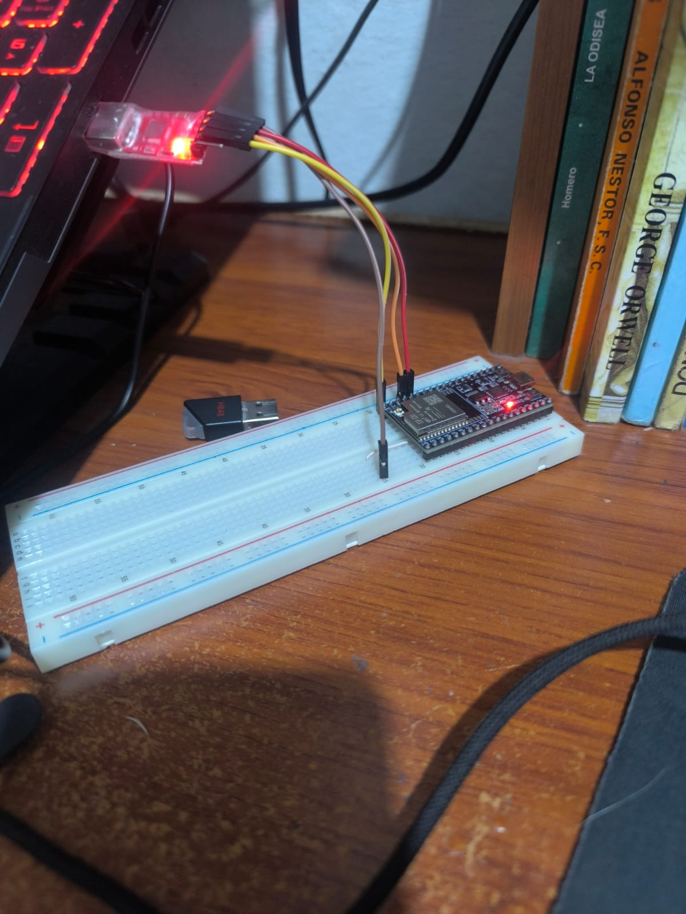

# Solución a Fallos Físicos: Puerto USB Quemado - Anura AI Monitor

En esta sección se tratan los diversos errores físicos ocurridos durante el proceso de desarrollo. Estos fallos son posibles, incidentales y completamente normales al trabajar con circuitos y productos electrónicos, dado que se trata de componentes delicados que requieren cuidado en su manipulación.

---

## 1. Problema: Puerto COM No Reconocido por Windows

Durante la compra de un ESP32 y su posterior instalación y conexión a la computadora, es normal que los puertos COM no aparezcan en el sistema. En caso de que esto ocurra, siga los siguientes pasos:

1. Presione la tecla **Windows + X**.
2. Acceda a **Administrador de Dispositivos**.
3. Verifique si aparece la sección **Puertos (COM y LPT)**.

En caso de que no aparezca, rectifique que su placa esté recibiendo suficiente energía. Puede identificarlo fácilmente por la presencia de un LED de color rojo que, en condiciones normales, permanece encendido de forma continua sin parpadear. Tenga cuidado si el LED parpadea, ya que esto indica un problema de inestabilidad: es posible que su computadora no esté suministrando suficiente energía al ESP32, o bien que el cable utilizado no funcione correctamente.

Una vez confirmado que su ESP32 tiene el LED rojo encendido de forma estable, asegúrese de que en Windows, dentro del **Administrador de Dispositivos**, aparezcan los puertos COM. Allí podrá verificar si es necesario actualizar los controladores del dispositivo, lo cual es bastante frecuente en instalaciones nuevas.

### 1.1 Instalación de Controladores (Drivers)

Intente realizar el proceso de la siguiente manera:

1. **Instalación automática:** Intente utilizar esta opción en primer lugar.
2. **Instalación manual:** Si la instalación automática no es posible, realice la instalación manual utilizando el archivo descargado en formato `.zip`.
   - (a) Extraiga el contenido del archivo `.zip`.
   - (b) Seleccione la carpeta **"64"** o el archivo `.sys` correspondiente a su sistema operativo.
3. Después de completar la instalación, realice la configuración de su entorno de desarrollo según las indicaciones específicas, utilizando como referencia el modelo exacto de su ESP32.

> **Nota:** Asegúrese de que el cable conectado entre su ESP32 y su computadora sea un **cable de datos**, ya que no cualquier cable USB es compatible. Aunque el LED del ESP32 esté encendido, si al revisar el Administrador de Dispositivos de Windows no aparece el puerto como conectado, significa que el cable utilizado es únicamente de carga y no transfiere datos, por lo que no es compatible para programación.

Ante todo, utilice siempre las entradas USB estándar de su computadora. Hasta el momento no se ha encontrado una forma confiable de utilizar los puertos USB-C de algunas laptops para transmitir la energía y los datos necesarios con estabilidad.

---

## 2. Problema: Puerto USB de la Placa Dañado o Quemado

El puerto USB Micro / Tipo-C incorporado en las placas de desarrollo ESP32 suele romperse físicamente por tracción mecánica o quemarse eléctricamente a causa de picos de voltaje generados por fuentes de alimentación inestables, o por cortocircuitos accidentales en los pines adyacentes. Cuando esto sucede, la computadora ya no reconoce el dispositivo (mostrando el error **"Dispositivo USB no reconocido"**), lo que impide tanto el flasheo del firmware como la depuración serial.

Dentro de las soluciones encontradas, es posible utilizar una pistola de calor para resoldar los pines del conector USB dañado. Si tiene la posibilidad de elegir, es preferible utilizar un ESP32 que incorpore un puerto USB-C; los modelos con Micro-USB generalmente requieren cables con salida hembra, lo que hace necesario conseguir un adaptador adicional que puede resultar incómodo y generar problemas de suministro de energía por la extensión del cableado.

### 2.1 Solución: Programación por TTL Externo (Bypass del Puente USB Integrado)

No es necesario desechar el ESP32. Es posible puentear el circuito dañado y conectarse directamente a los pines UART nativos del microcontrolador (TX0 y RX0) mediante un programador externo USB a Serial TTL (FTDI, CP2102 o CH340).



#### Conexiones de Programación:

| Programador FTDI (TTL)       | Pin ESP32    | Notas                                                        |
| :--------------------------- | :----------- | :----------------------------------------------------------- |
| **GND**                | GND          | Tierra de referencia compartida (Obligatorio)                |
| **TXD** (Transmisión) | RX0 (GPIO 3) | El pin de salida del programador va al receptor del ESP32    |
| **RXD** (Recepción)   | TX0 (GPIO 1) | El pin de entrada del programador va al transmisor del ESP32 |
| **5V / VCC**           | VIN (o 5V)   | Provee energía al ESP32 desde el puerto USB de la PC        |

> [!WARNING]
> Nunca conecte el pin TXD al TX0 ni el RXD al RX0 del ESP32. Las líneas UART se cruzan (TX $\rightarrow$ RX y RX $\rightarrow$ TX).

### 2.2 Verificación del Adaptador TTL Antes de Conectar al ESP32

Si desea verificar el funcionamiento de su TTL externo antes de conectarlo al ESP32, utilice un cable hembra para puentear los pines **TXD** y **RXD** del conector TTL entre sí. A continuación, conéctelo al puerto USB de su computadora.

Una vez conectado, siga estos pasos:

1. Abra el **Monitor Serie** en su entorno de desarrollo (Arduino IDE u otro).
2. Seleccione ambas opciones de fin de línea: **NL y CR** (Newline y Carriage Return).
3. Configure la velocidad en baudios para que coincida con la del dispositivo.

Posteriormente, en el campo de texto del monitor, escriba cualquier mensaje. Si el mensaje aparece reflejado de vuelta con la marca de tiempo de recepción, significa que su conector TTL funciona correctamente. Si no aparece ninguna respuesta, es probable que su adaptador TTL sea defectuoso o que los drivers no estén correctamente instalados.

---

## 3. Secuencia de Programación Manual (Flash Manual)

Dado que los programadores TTL genéricos no tienen control sobre las líneas DTR y RTS que automatizan el proceso de reset y la entrada al modo de carga en el IDE de Arduino, es necesario forzarlo de forma manual desde la protoboard:

1. Coloque un cable puente desde el pin **GPIO 0** hacia **GND**.
2. Encienda el circuito o presione el botón **EN / RST** en el ESP32.
3. En el IDE de Arduino, haga clic en **Subir / Upload**.
4. Cuando el compilador termine y comience a mostrar los puntos de conexión en la consola:
   `Connecting........___`
5. La transferencia del código se iniciará automáticamente.
6. Una vez finalizada la carga (mensaje: `Hash of data verified`), **desconecte GPIO 0 de GND** y presione el botón **EN / RST** una vez más para iniciar su firmware.

En caso de no seguir estos pasos de forma correcta durante la carga del código, aparecerá el siguiente mensaje de error en la consola:

```
A fatal error occurred: Failed to connect to ESP32: No serial data received.

For troubleshooting steps visit: https://docs.espressif.com/projects/esptool/en/latest/troubleshooting.html

Failed uploading: uploading error: exit status
```

> [!NOTICE]
> Considere que, para que el código se ejecute posteriormente, debe desconectar el pin 0 y el GND. En caso de que no lo haga, el programa nunca se va a ejecutar; es imprescindible desconectar ese pin.

---

## 4. Problema: Alcance Limitado de Bluetooth (Sin Antena Externa)

Debido a que se está utilizando el modelo **ESP32-WROOM-32U**, el cual no posee una antena integrada en la placa pero sí incluye un conector U.FL para antena externa, la conexión Bluetooth tiene un alcance máximo de aproximadamente **3 metros estables** sin antena adicional.

En caso de que sea necesario ampliar este rango de cobertura, se deberá conectar una antena externa en el conector U.FL del ESP32 de este modelo. Cabe destacar que no todos los modelos de ESP32 presentan esta característica ni esta limitación de alcance.
