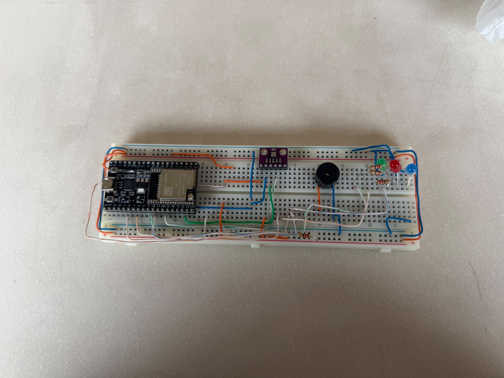
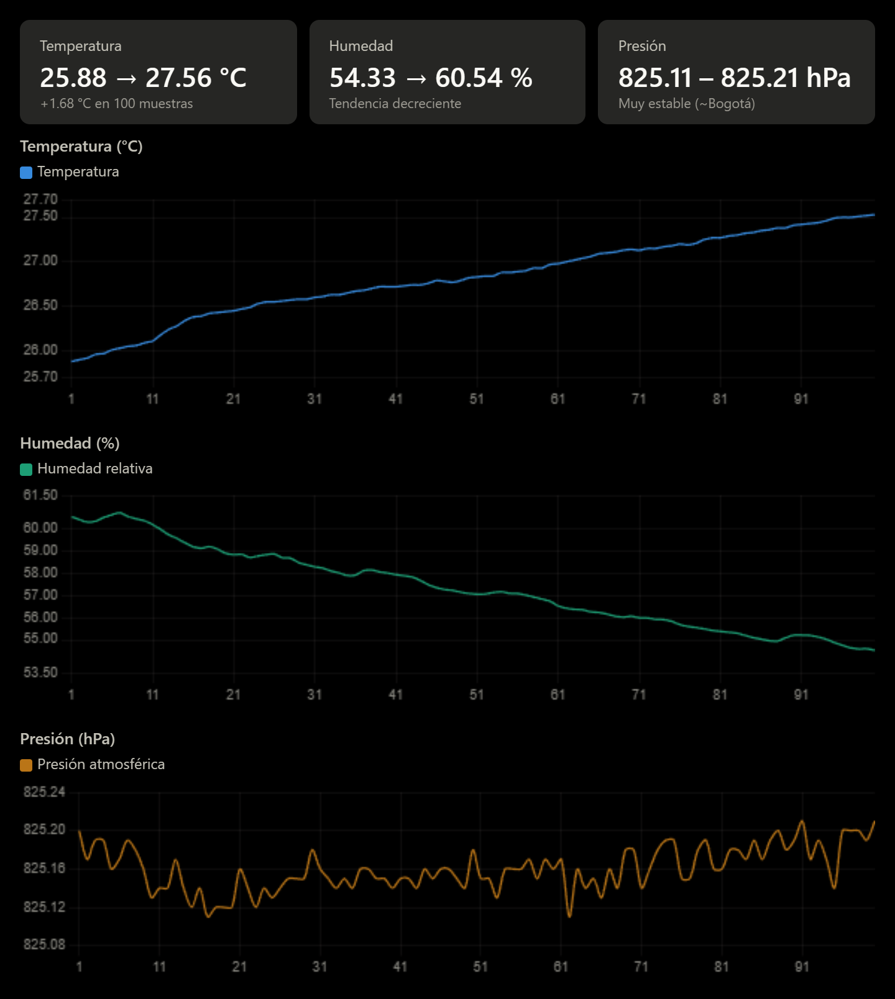

# Anura AI Monitor 🐸🌦️



Un aspecto crítico que se debe recalcar en el desarrollo de sistemas embebidos es que, a diferencia de la programación de software puro donde la complejidad se limita al control de variables lógicas y de entorno digital, en el diseño de circuitos el ámbito de las variables se extiende de forma drástica hacia el hardware.

Bajo este enfoque, el comportamiento del sistema no solo depende del código ejecutado, sino también de las condiciones físicas y medioambientales del entorno real (como la temperatura, la humedad, la atenuación de señales por cableado o las fluctuaciones de voltaje). Cualquier perturbación en estas variables físicas introduce un factor de impredictibilidad que puede alterar el correcto procesamiento de los datos o comprometer la estabilidad del hardware.

En la documentación se mencionan las medidas en las que se solucionaron los problemas que encontramos.

Este repositorio contiene el ecosistema completo de hardware, software, pruebas, diagnósticos e integración para el nodo sensor **Anura AI Monitor**. Este dispositivo está diseñado para el monitoreo microclimático en tiempo real y de bajo consumo en hábitats de anfibios vulnerables.



---

## 📁 Estructura del Repositorio

El proyecto está organizado de manera modular y limpia para facilitar su escalabilidad, mantenimiento y carga a GitHub. A continuación se detalla el propósito de cada directorio:Anura_AI_Monitor/
​
```

Nota: GitHub renderiza `xychart-beta` desde Mermaid 10+, que ya soporta. Se ve bien en READMEs públicos y privados.
Anura_AI_Monitor/
├── 📁 1_Hardware_y_Montaje/
│   ├── Manual_Montaje.md
│   ├── Esquematico_Conexiones.md
│   ├── Lista_Componentes.md
│   ├── Guia_Alimentacion_Energia.md
│   └── datasheets.md
├── 📁 2_Software_y_Codigo/
│   └── 📁 Firmware_ESP32/
│       └── Firmware_ESP32.ino
└── 📁 4_Errores_y_Soluciones/
    ├── Registro_Fallos_Fisicos.md
    ├── Solucion_Errores_Bluetooth.md
    ├── Solucion_Errores_WiFi.md
    ├── Solucion_Sensores.md
    ├── Errores_Alimentacion.md
    └── Bugs_Firmware.md
```
---

## 🛠️ Especificaciones de Hardware (BOM Resumido)

El circuito base está integrado en una protoboard de 830 puntos bajo las siguientes especificaciones:

1. **Controlador:** Módulo ESP32-WROOM-32U con conector coaxial U.FL para acoplar una antena externa de 5dBi.
2. **Sensor:** Bosch BME280 conectado mediante bus digital I2C (GPIO 21 SDA y GPIO 22 SCL).
3. **Periféricos de Alerta:** Un LED verde indicador en el pin GPIO 2 (con resistencia limitadora de $220\Omega$) y un zumbador (Buzzer) activo en el pin GPIO 4 (con resistencia de $100\Omega$).
4. **Divisor de Tensión:** Dos resistencias de $100\text{ k}\Omega$ en serie conectadas al borne positivo de la batería para reducir el voltaje de 4.2V a 2.1V máximo, permitiendo la lectura del ADC por el pin GPIO 34.

---

## 🚀 Guía de Inicio Rápido (Software)

### 1. Requisitos

- **Arduino IDE** (v2.0+) o **VS Code con PlatformIO**.
- Librerías externas: `Adafruit BME280 Library` (junto con `Adafruit Unified Sensor` y `Adafruit BusIO`) y `PubSubClient`.

### 2. Compilación y Flasheo

1. Configura tu placa en la IDE en el menú **Herramientas**:
   - Tarjeta: **"ESP32 Dev Module"**
   - Speed: **115200** (o 921600)
   - Partition Scheme: **Default 4MB with spiffs** (o LittleFS)
2. Si usas placa v2 sin auto-reset:
   - Conecta **GPIO 0** a **GND**.
   - Presiona el botón de **Reset / EN** para entrar a modo descarga.
3. Abre el archivo `Firmware_ESP32.ino` ubicado en `2_Software_y_Codigo/Firmware_ESP32/` y haz clic en **Subir**.
4. Una vez cargado, desconecta el puente de GPIO 0 y presiona **Reset** para iniciar el dispositivo.


